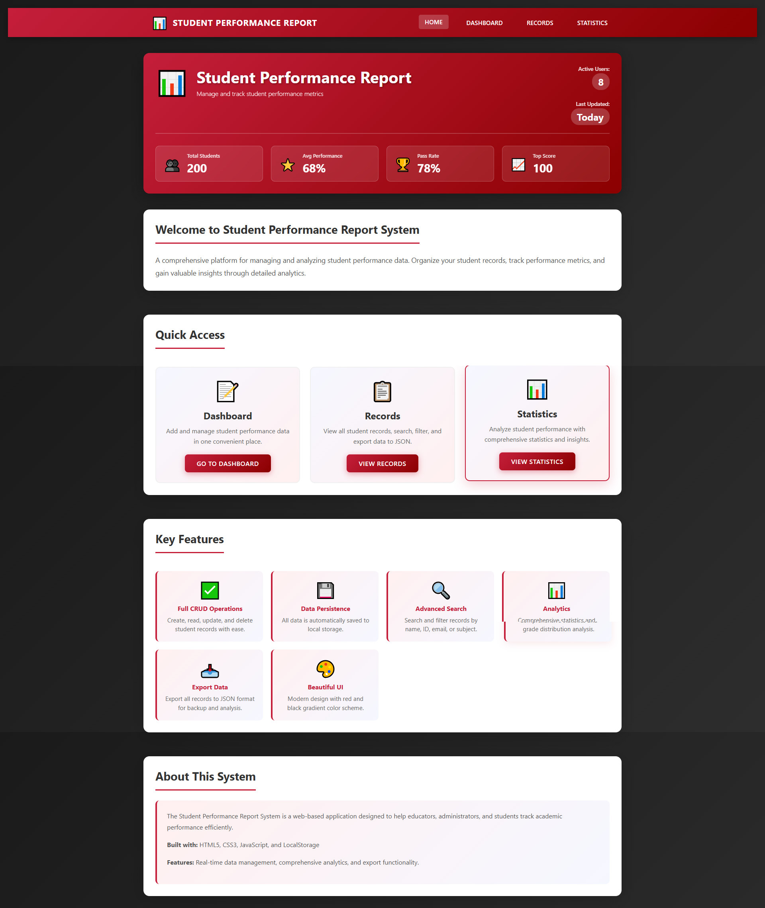
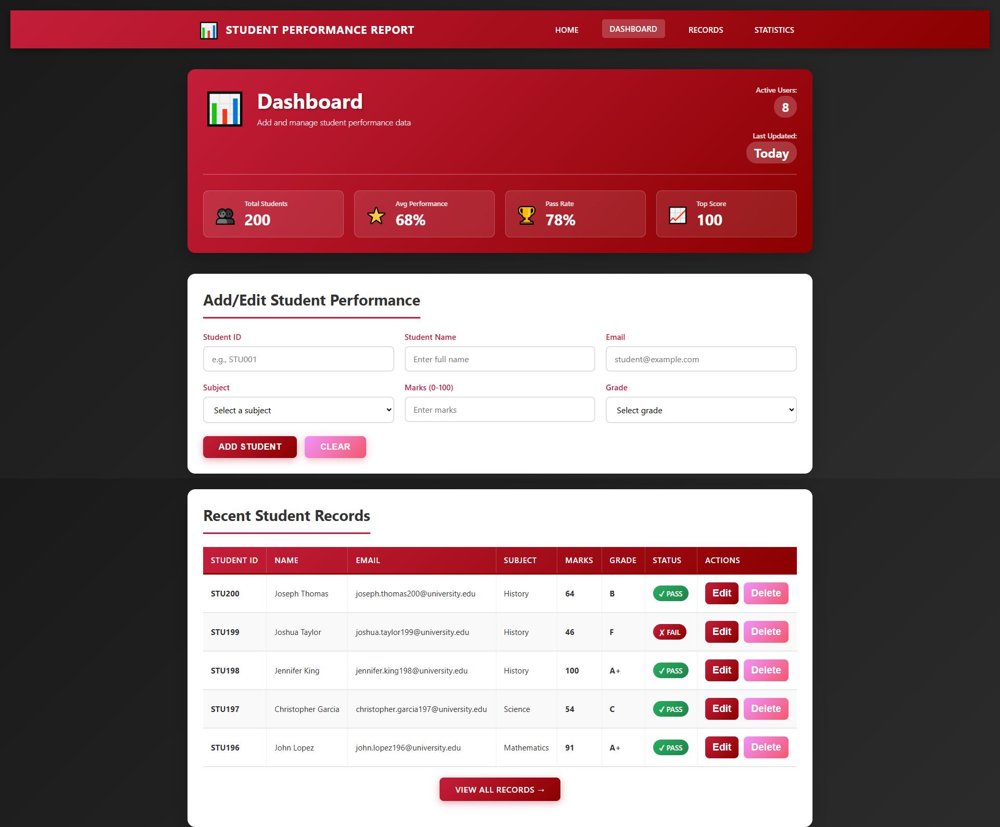
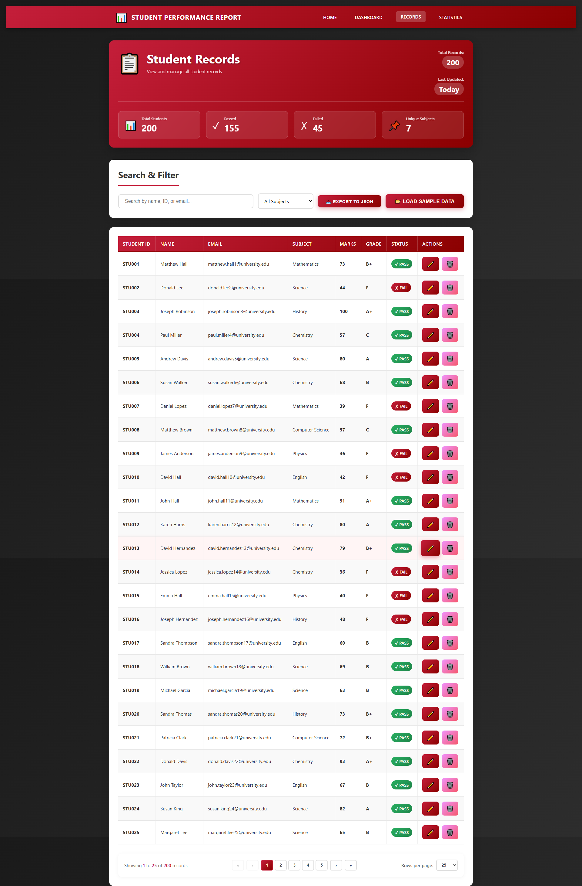
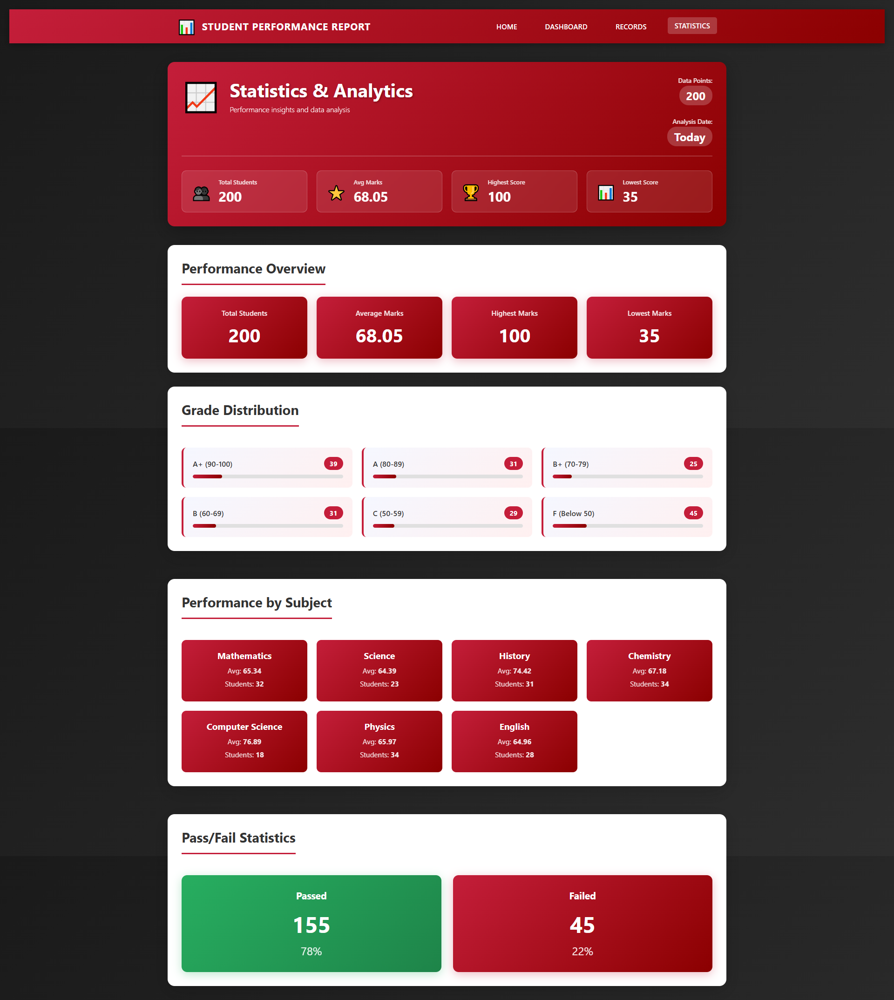

"# 📊 Student Performance Report System

A comprehensive web-based application for managing and analyzing student academic performance with an intuitive interface and powerful analytics.


---

## 🎯 Project Overview

The **Student Performance Report System** is a feature-rich academic management tool that enables educational institutions to efficiently track, manage, and analyze student performance across multiple subjects. Built with vanilla JavaScript, this system offers a clean, responsive interface with real-time data updates and comprehensive statistical analysis.

---

## ✨ Key Features

### 📝 Dashboard - Data Management
- ➕ Add new student records with complete information
- ✏️ Edit existing records with one-click access
- 🔄 Real-time form validation
- 📊 View recent 5 records at a glance
- 🎯 Auto-calculated grades based on marks
- 💾 Instant data persistence

### 📋 Records - Complete Database View
- 📄 **Pagination System**: Navigate through records efficiently (10/25/50/100/All per page)
- 🔍 **Advanced Search**: Find students by name, ID, or email
- 🎓 **Subject Filter**: Filter records by specific subjects
- ✏️🗑️ **Quick Actions**: Edit and delete with icon buttons
- 📥 **Export Feature**: Download complete data as JSON
- 📊 **Visual Status**: Color-coded Pass/Fail indicators
- 🔢 **Smart Navigation**: Page numbers, first, previous, next, last controls

### 📈 Statistics - Analytics Dashboard
- 📊 **Overview Metrics**: Total students, average marks, highest/lowest scores
- 📉 **Grade Distribution**: Visual bar charts for all grade categories (A+, A, B+, B, C, F)
- 📚 **Subject Performance**: Individual performance cards for each subject
- ✅ **Pass/Fail Analysis**: Percentage breakdown with visual indicators
- 🎨 **Interactive Visualizations**: Dynamic charts that update in real-time

### 🏠 Home - Navigation Hub
- 🎯 Quick access cards to all sections
- 📊 Live statistics in header
- 🎨 Modern, attractive interface
- 📱 Fully responsive design

---

## 📸 Screenshots

### Home Page

*Clean and modern landing page with quick navigation and live statistics*

### Dashboard - Add/Edit Records

*Intuitive form interface with real-time validation and recent records display*

### Records - Complete Database

*Paginated table view with search, filter, and quick action buttons*

### Statistics - Analytics Dashboard

*Comprehensive statistical analysis with visual charts and grade distribution*

---

## 🛠️ Technology Stack

### Frontend
- **HTML5** - Semantic markup and structure
- **CSS3** - Modern styling with:
  - Flexbox & Grid layouts
  - Gradient backgrounds
  - Smooth animations and transitions
  - Fully responsive design
- **JavaScript (ES6+)** - Vanilla JavaScript with:
  - No frameworks or libraries
  - Local Storage API for data persistence
  - Dynamic DOM manipulation
  - Event-driven architecture

### Design
- **Color Scheme**: Professional Red & Black theme
  - Primary: `#c41e3a` (Red)
  - Secondary: `#8b0000` (Dark Red)
  - Background: `#1a1a1a` (Black)
- **Typography**: Clean sans-serif fonts
- **Icons**: Unicode emoji icons (✏️, 🗑️, 📊, etc.)
- **Responsive**: Mobile-first approach

---

## 📁 Project Structure

```
Student performance report/
│
├── 📄 index.html              # Home/Landing page
├── 📄 dashboard.html          # Add/Edit student records
├── 📄 records.html            # View all records with pagination
├── 📄 statistics.html         # Statistical analysis and charts
│
├── 🎨 styles.css              # Complete styling (1144+ lines)
├── ⚙️ script.js               # Core JavaScript logic (377+ lines)
│
├── 💾 data.json               # JSON database (200 records)
├── 💾 data.js                 # JavaScript version of data
│
├── 📸 images/                 # Screenshots folder
│   ├── screencapture-index.png
│   ├── screencapture-dashboard.png
│   ├── screencapture-records.png
│   └── screencapture-statistics.png
│
├── 📖 README.md               # This file
└── 📚 DOCUMENTATION.md        # Detailed documentation
```

---

## 🚀 Getting Started

### Installation

No installation required! This is a standalone web application.

#### Method 1: Direct Access (Recommended)
```bash
1. Download or clone the repository
2. Navigate to the project folder
3. Double-click any HTML file (index.html, dashboard.html, etc.)
4. Application opens in your default browser
5. Data automatically loads from data.js
```

#### Method 2: Local Server (Optional)
```bash
# Using Python 3
cd "Student performance report"
python -m http.server 8000

# Using Node.js
npx http-server

# Access at: http://localhost:8000
```

### First Run
- ✅ No dependencies to install
- ✅ No server required
- ✅ Works completely offline
- ✅ 200 sample records pre-loaded
- ✅ Data persists in browser localStorage

---

## 📖 How to Use

### Adding a Student
1. Go to **Dashboard** page
2. Fill in the form:
   - Student ID (e.g., STU001)
   - Full Name
   - Email Address
   - Subject (dropdown)
   - Marks (0-100)
   - Grade (auto-calculated)
3. Click **"Add Student"**
4. ✅ Success notification appears

### Viewing All Records
1. Navigate to **Records** page
2. Browse through paginated records
3. Use search bar for specific students
4. Filter by subject using dropdown
5. Change rows per page as needed

### Editing a Record
1. Find the student in the table
2. Click the **✏️ Edit icon**
3. Modify the fields in the form
4. Click **"Update Student"**
5. ✅ Changes saved immediately

### Deleting a Record
1. Locate the student
2. Click the **🗑️ Delete icon**
3. Confirm the deletion
4. ❌ Record removed permanently

### Viewing Statistics
1. Open **Statistics** page
2. View key metrics at the top
3. Analyze grade distribution chart
4. Review subject-wise performance
5. Check pass/fail percentages

### Exporting Data
1. On **Records** page
2. Click **"📥 Export to JSON"**
3. File downloads automatically
4. Filename includes current date

---

## 🎨 Features Showcase

### Pagination System
- ⏮️ First page
- ◀️ Previous page
- Page numbers (1, 2, 3, ...)
- ▶️ Next page
- ⏭️ Last page
- 📊 Shows "X to Y of Z records"
- ⚙️ Configurable rows per page

### Search & Filter
- 🔍 Real-time search (instant results)
- 🎓 Filter by subject
- 🔄 Combined search + filter
- 📄 Automatically resets to page 1

### Data Validation
- ✅ Required field checks
- ✅ Email format validation
- ✅ Marks range (0-100)
- ✅ Real-time error messages

### Grade Calculation
```
Marks >= 90  →  A+  (Excellent)
Marks >= 80  →  A   (Very Good)
Marks >= 70  →  B+  (Good)
Marks >= 60  →  B   (Above Average)
Marks >= 50  →  C   (Average)
Marks <  50  →  F   (Fail)
```

---

## 💾 Data Management

### Storage Methods
1. **Primary**: Browser localStorage
2. **Backup**: data.js file
3. **Export**: JSON file download

### Data Format
```javascript
{
  id: "STU_17656497717661_9aiahxs2z",
  studentId: "STU001",
  studentName: "John Doe",
  email: "john.doe@university.edu",
  subject: "Mathematics",
  marks: 85,
  grade: "A",
  timestamp: "2025-12-18T10:30:00.000Z",
  updatedAt: "2025-12-18T10:30:00.000Z"
}
```

### Available Subjects
- 📐 Mathematics
- 📚 English
- 🔬 Science
- 📜 History
- 💻 Computer Science
- ⚛️ Physics
- 🧪 Chemistry

---

## 🌐 Browser Compatibility

| Browser | Version | Status |
|---------|---------|--------|
| Google Chrome | 90+ | ✅ Fully Supported |
| Mozilla Firefox | 88+ | ✅ Fully Supported |
| Microsoft Edge | 90+ | ✅ Fully Supported |
| Safari | 14+ | ✅ Fully Supported |
| Opera | 76+ | ✅ Fully Supported |

### Mobile Responsive
- 📱 Tablet: Optimized at 768px breakpoint
- 📱 Mobile: Optimized at 480px breakpoint
- 👆 Touch-friendly buttons and controls
- 📐 Adaptive layouts for all screen sizes

---

## 🎯 System Requirements

### Minimum Requirements
- Modern web browser (2021+)
- JavaScript enabled
- localStorage support
- 1024x768 screen resolution (recommended)
- No internet connection required

### Recommended
- Chrome 90+ or Firefox 88+
- 1920x1080 resolution
- 2GB RAM
- Any operating system (Windows, Mac, Linux)

---

## 🔧 Customization

### Changing Colors
Edit `styles.css`:
```css
/* Primary red color */
#c41e3a → Your color

/* Dark red */
#8b0000 → Your color
```

### Adding Subjects
Update the subject dropdown in HTML files:
```html
<option value="New Subject">New Subject</option>
```

### Modifying Grade Scale
Edit `script.js` → `updateGradeAutomatically()` function

### Changing Pagination
Edit `records.html`:
```javascript
let rowsPerPage = 25; // Change default
```

---

## 📊 Sample Data

The system comes pre-loaded with:
- **200 student records**
- **7 different subjects**
- **Mix of all grade levels**
- **Realistic student data**
- **Pass/Fail distribution**

---

## 🐛 Troubleshooting

| Issue | Solution |
|-------|----------|
| No data showing | Click "Load Sample Data" button |
| Changes not saving | Check localStorage is enabled |
| Pagination not working | Refresh the page |
| Statistics not updating | Navigate to Dashboard then back |
| Export not downloading | Check browser permissions |

---

## 🚀 Future Enhancements

### Planned Features
- 🔐 User authentication system
- 📧 Email notifications
- 📊 More chart types (pie, line, area)
- 🖨️ Print-friendly reports
- 📱 Progressive Web App (PWA)
- 🗄️ Backend database integration
- 📈 Attendance tracking module
- 👥 Role-based access (admin, teacher, student)
- 📅 Date range filtering
- 🔍 Advanced search operators

---

## 📝 Documentation

For detailed documentation, see [DOCUMENTATION.md](DOCUMENTATION.md)

Includes:
- Complete API reference
- Function documentation
- Code structure explanation
- Development guidelines
- Advanced customization

---

## 👨‍💻 Developer Information

### Project Details
- **Type**: Educational Web Application
- **Course**: Web Technology
- **Semester**: 5th Semester
- **Year**: 2025
- **Version**: 1.0.0

### Code Statistics
- **HTML Files**: 4
- **CSS Lines**: 1144+
- **JavaScript Lines**: 377+
- **Total Records**: 200 (sample data)
- **Subjects**: 7

---

## 📄 License

This project is developed for educational purposes.
- ✅ Free to use
- ✅ Free to modify
- ✅ Free to distribute
- 📚 Educational project license

---

## 🙏 Acknowledgments

- Icons: Unicode Emoji
- Color Scheme: Custom Red & Black Theme
- Design: Modern Material Design inspired
- Technologies: Pure HTML, CSS, JavaScript (no frameworks)

---

## 📞 Support

If you encounter any issues:
1. Check the [DOCUMENTATION.md](DOCUMENTATION.md) file
2. Review browser console for errors
3. Ensure JavaScript is enabled
4. Verify all files are in the same directory
5. Try clearing browser cache

---

## 🌟 Features at a Glance

| Feature | Status |
|---------|--------|
| Add Students | ✅ |
| Edit Students | ✅ |
| Delete Students | ✅ |
| Search Functionality | ✅ |
| Filter by Subject | ✅ |
| Pagination | ✅ |
| Export to JSON | ✅ |
| Statistics Dashboard | ✅ |
| Grade Distribution | ✅ |
| Responsive Design | ✅ |
| Offline Support | ✅ |
| No Dependencies | ✅ |

---

## 📈 Project Stats

```
Lines of Code: 1521+
Files: 9
Images: 4 screenshots
Features: 20+
Pages: 4
Subjects Supported: 7
Sample Records: 200
```

---

## 🎓 Academic Project

This is a **Web Technology** course project demonstrating:
- Frontend web development skills
- JavaScript programming
- Responsive design
- Data management
- User interface design
- Client-side storage
- Single Page Application concepts

---

<div align="center">

### Made with ❤️ for Academic Excellence

**Student Performance Report System v1.0.0**

[View Documentation](DOCUMENTATION.md) | [Report Issues](#support)

---

⭐ Star this project if you find it useful!

**Last Updated**: December 18, 2025

</div>" 
